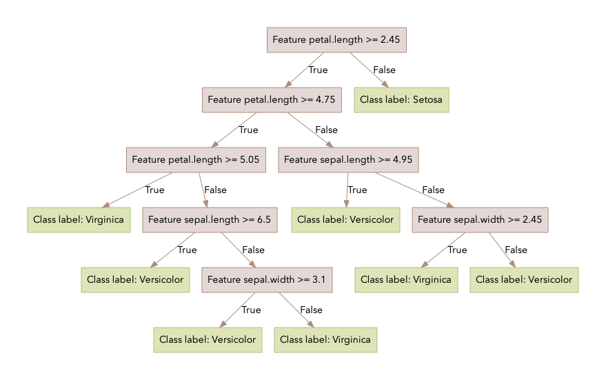
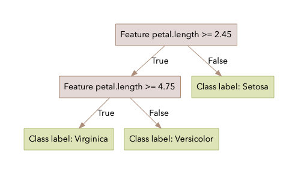
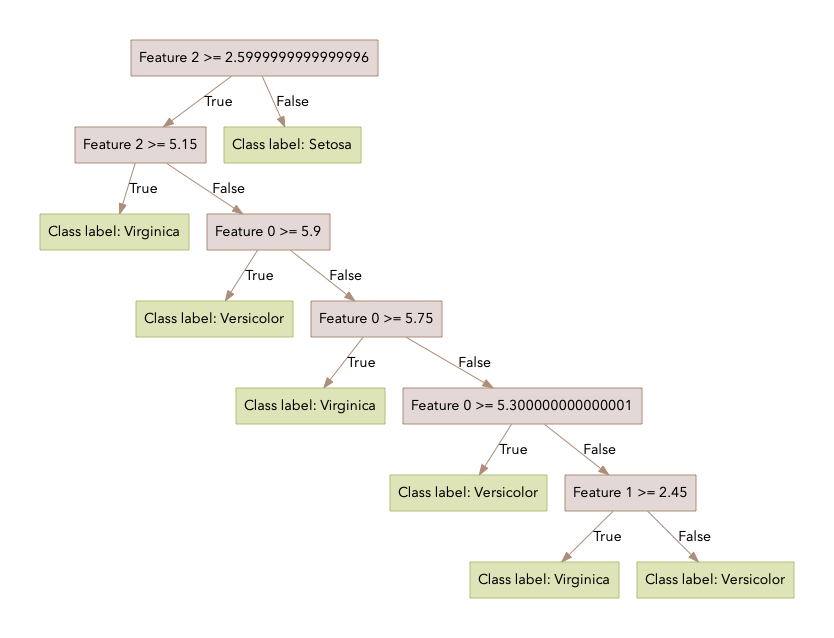

# Decision-Tree
## Introduction
This package allows the user to build a decision tree from a previously unseen dataset.
Once the tree is built the user can test the accuracy of the tree, predict the class label
of an unclassified datapoint and create a labeled visualisation of the decision tree. 
An additional feature allows the user to split their dataset into 
training, test and validation sets prior to building the decision tree.

### Getting started with the package
To get started with this package clone this repo:

```bash
git clone https://github.com/mwolinska/Decision-Tree
```
Then enter the correct directory on your machine:
```bash
cd Decision-Tree
```
This package uses [poetry](https://python-poetry.org) dependency manager. 
To install all dependencies run:

```bash
poetry install
```

## Using the package
### File structure
The file structure we propose is outlined below. 
This was used to generate the suggested_commands
```bash
.
├── Decision-Tree
│   └──Decision_Tree
└── Decision-Tree-Data
    └── Iris-Dataset
        └── iris.csv
```
### Dataset format
Currently, this package only accepts datasets in csv format, where the following conditions need to be met:
- data labels are the last column in string format, 
- feature labels are in the first row of the data
- feature data is numerical
The dataset can be saved anywhere as it is passed as an argument.

### Available commands
The cli is triggered by using the decision-tree command, which launches the cli script.
The cli has 3 commands:
- run
- load
- help

An example run using the [iris dataset](https://archive.ics.uci.edu/ml/datasets/iris) 
 is outlined below.

#### Run command
This function takes a full dataset (in csv format), separates it into training, validation and test sets. 
It then generates a decision tree based on the training data. 
It has optional arguments:
- output: tree can be saved by specifying output in pickle format,
- --prune (True by default): specifies whether pruning should be defined, and 
- -draw-tree (string, empty by default): specifies destination of tree visualisations, 
if it is not set, no visualisations will be generated.

To create a decision tree based on the iris.csv dataset and 
save it as "iris_decision_tree.pickle" the following command can be run:

```bash
decision-tree run <your-csv-file> <path-to-save-your-tree>/decision_tree.pickle
```

To set either the prune or draw-tree variables, use one the following syntaxes:

```bash
decision-tree run <your-csv-file> -p False -d <path-to-save-your-visuals>/<desired-folder-name>/
```
Or:

```bash
decision-tree run <your-csv-file> --prune False --draw-tree <path-to-save-your-visuals>/<desired-folder-name>/
```

Once a run is completed, if the draw-tree argument was set to True 
the decision tree will be saved under "tree_visual.pdf" in the
project directory. If the feature and label names are added to the training dataset, those are included in
the tree visualisation. The tree generated using the run above would look like this:



If the prune variable is set to True the pruned tree visualisation will be saved under 
"pruned_tree.pdf" in the project directory. For this run it would look like this:



If the feature names are not included in the dataset the tree will be labeled using
column indices as feature numbers. This image is generated using a different run than those above.



#### Load command
The load command allows the user to load an existing decision tree (in pickle format)
and generate predictions for a dataset. The user needs to specify the 
filename from which the tree will be loaded,
the csv containing the data points requiring prediction and
the output file where the predicted values should be stored.
An example run would look like this:

```bash
decision-tree load ../Decision-Tree-Data/Iris-Dataset/iris_decision_tree.pickle ../Decision-Tree-Data/Iris-Dataset/samples_for_prediction.csv ../Decision-Tree-Data/Iris-Dataset/predictions.csv
```
#### Help command
Default command to view available command.

## Using the package with docker
A docker image of the package is available here. 

To download the docker image run:

```bash
 docker pull mwolinska/decision-tree:latest
```

To load and save data outside of the docker image it is necessary to mount a directory from your machine
into the docker image. The following command runs the decision-tree run command, saves the output
and generates the visuals.

```bash
docker run \
  -v $(pwd)/Decision-Tree-Data:/workdir/All-Data \
  -it mwolinska/decision-tree:latest \
  run /workdir/All-Data/Iris-Dataset/iris.csv /workdir/All-Data/Iris-Dataset/test.pickle \
  -d /workdir/All-Data/Iris-Dataset/visual/
```

This will result in the following files being generated:

```bash
Decision-Tree-Data
└── Iris-Dataset
    ├── iris.csv
    ├── test.pickle
    └── visual
        ├── pruned_tree
        ├── pruned_tree.pdf
        ├── unpruned_tree_visual
        └── unpruned_tree_visual.pdf
```
