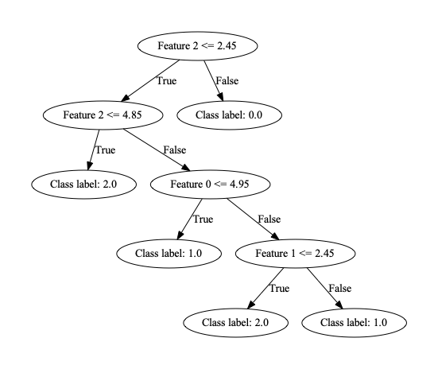

# Decision-Tree
## Introduction
This package allows the user to build a decision tree from a previously unseen dataset.
Once the tree is built the user can test the accuracy of the tree, predict the class label
of an unclassified datapoint and create a labeled visualisation of the decision tree. 
An additional feature allows the user to split their dataset into 
training, test and validation sets prior to building the decision tree.

### Getting started with the package
To get started with this package clone this repo:

```bash
git clone https://github.com/mwolinska/Decision-Tree
```
Then enter the correct directory on your machine:
```bash
cd Decision-Tree
```
This package uses [poetry](https://python-poetry.org) dependency manager. 
To install all dependencies run:

```bash
poetry install
```

### Using the package
Command line interface is not implemented in v1.0.0. An example run using the
[iris dataset](https://archive.ics.uci.edu/ml/datasets/iris) would look like this. Please note the preparation of the dataset into the correct
format is not yet implemented. 

```python
    import numpy as np
    from sklearn.datasets import load_iris
    dataset = load_iris()
    features = dataset["data"]
    labels = dataset["target"]

    dataset = np.hstack([features, labels.reshape(-1, 1)])

    training_set, test_set, validation_set = split_dataset_using_shuffle(dataset, 
                                                                         dataset_ratio_for_training=0.6)
    tree = DecisionTreeClassifier.from_dataset(training_set)
    success_rate = tree.evaluate_tree(validation_set)
    tree.draw()

```

Once a run is completed, the decision tree will be saved under "tree_visual.pdf" in the
project directory. The tree generated using the run above would look like this:



If the feature and label names are added to the training dataset, those are included in
the tree visualisation for greater clarity.


